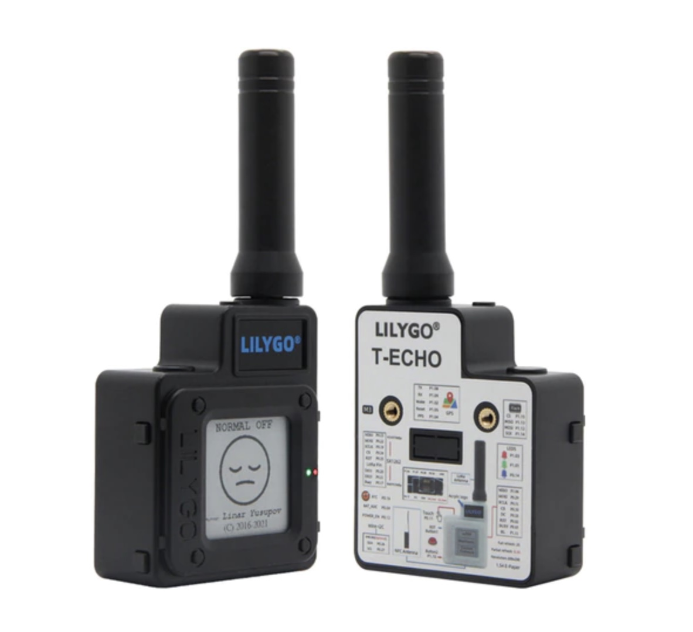

Zoals [eerder gezegd](/Scuttlebutt) houden wij wel van een beetje DIY en decentrale toestanden. [meshtastic](https://meshtastic.org) past in dat straatje. Want zoals ze zelf zeggen:

> Meshtastic is an off-grid, encrypted communication platform that runs open source software on affordable radios. These radios rebroadcast messages they receive in order to create a mesh network.

Eigenlijk is het open source firmware die je op een ESP32 bord kan zetten. Als je dan de juiste antennes en voeding eraan hangt, heb je een zender/ontvanger die een [LoRa](https://internetofthingsnederland.nl/kennisbank/netwerken/lora/) [mesh netwerk](https://en.wikipedia.org/wiki/Mesh_networking) vormt met andere meshtastic apparaten. Vervolgens kun je met je telefoon verbinding maken met je meshtastic apparaat en kun je berichten sturen naar anderen. LoRa is te langzaam voor spraak of andere spannende dingen, dus het blijft bij tekstberichten. Twee apparaten kunnen tot ongeveer 13 kilometer prima met elkaar communiceren. Het kan nog [verder](https://meshtastic.discourse.group/t/practical-range-test-results/692/3) als je met allemaal speciale antennes en toestanden aan de slag gaat. LoRa werkt niet zo super in een stad of bos met veel obstakels. Dan komt ze niet verder dan een paar kilometer.

## Vet

Ja, best mooi bedacht. De apparaatjes kosten ook maar een paar tientjes en je kan ze ook zelf maken. [Aliexpress](https://nl.aliexpress.com/wholesale?SearchText=meshtastic) staat er al mee vol (zie ook de afbeelding hierboven), ondanks dat het project nog niet zo heel groot is. En het is natuurlijk best tof om op deze manier - helemaal off grid - te kunnen communiceren. Op dit moment kun je alleen nog maar berichten over een weer sturen via de [Meshtastic app](https://meshtastic.org/docs/software/apple/installation/). In de toekomst moet het mogelijk worden om te communiceren via meer verschillende apps op je telefoon.

## Toepassing

Eigenlijk kun je er nu nog niet zo heel veel mee doen, behalve een beetje klooien. Ik kom zelf ook eigenlijk nooit in de situatie dat ik met m'n telefoon geen verbinding heb. Daarnaast moeten er aardig wat apparaten in de buurt zijn om echt een meshnetwerk te vormen. Er zijn er nu nog maar een stuk of twintig [in Nederland](https://meshmap.net/). Dit is meer voor de mensen die met een groep de jungle in gaan, off piste gaan skiën of de oceaan willen oversteken. Of natuurlijk als de hele maatschappij in elkaar stort, en je via Meshtastic op de hoogte kan blijven van de nieuwtjes rondom vorming van het kabinet Van der Plas 1. Het hele project bevindt zich ook nog in een soort Alpha fase. De iOS app is bijvoorbeeld nog niet eens echt beschikbaar (je hebt nog Testflight nodig).

Hopelijk wordt het nog ooit iets, want ik vind dit soort dingen super vet. Misschien maar eens zo'n ding kopen met het gevaar dat het een presse papier van 50 euro wordt....

## Links

- Site van Meshtastic [meshtastic.org](https://meshtastic.org)
- Site nog wat meer info [meshtastic.letstalkthis.com](https://meshtastic.letstalkthis.com/)
- Review die Hackernews heeft gehaald [Meshtastic a review](https://tylercipriani.com/blog/2022/07/31/meshtastic-a-review/)
- Kaart met Meshtastic nodes [Meshtastic map](https://meshmap.net/)
