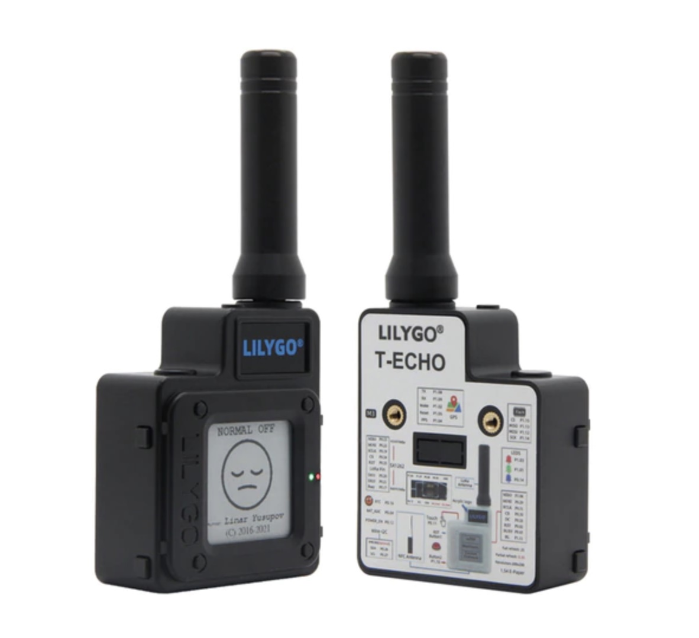

Zoals [eerder gezegd](/Scuttlebutt) houden wij wel van een beetje DIY en decentrale toestanden. [Mashtastic](https://meshtastic.org) past in dat straatje. Want zoals ze zelf zeggen:

> Meshtastic is an off-grid, encrypted communication platform that runs open source software on affordable radios. These radios rebroadcast messages they receive in order to create a mesh network.

Eigenlijk is het open source firmware je op je ESP32 kan zetten. Als je dan de juiste antennes en voeding eraan hangt, heb je een zender/ontvanger die een [LoRa](https://internetofthingsnederland.nl/kennisbank/netwerken/lora/) netwerk vormt met andere Mashtastic apparaten. Vervolgens kun je met je telefoon verbinding maken met je Mashtastic apparaat en kun je berichten sturen naar anderen. LoRa is te langzaam voor spraak of andere spannende dingen, dus het blijft bij tekstberichten.

## Vet

Ja, best mooi bedacht. De apparaatjes kosten ook maar een paar tientjes en zou je ook zelf kunnen maken. [Aliexpress](https://nl.aliexpress.com/wholesale?SearchText=meshtastic) staat er al mee vol, ondanks dat het project nog niet zo heel groot is. En het is natuurlijk best tof om op deze manier -helemaal off grid- te kunnen communiceren. Op dit moment kun je alleen nog maar berichten over een weer sturen via de [Meshtastic app](https://meshtastic.org/docs/software/apple/). In de toekomst moet het mogelijk worden om te communiceren via meer verschillende apps op je telefoon.

## Toepassing

Eigenlijk kun je er nu nog niet zo heel veel mee doen, behalve een beetje klooien. Ik kom zelf ook eigenlijk nooit in de situatie dat ik met m'n telefoon geen verbinding heb. Daarnaast moeten er aardig wat apparaten in de buurt zijn om echt een meshnetwerk te vormen. Er zijn er nu nog maar een stuk of twintig [in Nederland](https://canvis.app/meshtastic-map). Dit is meer voor de mensen die met een groep de jungle in gaan of de oceaan gaan oversteken. Of natuurlijk als de hele maatschappij in elkaar stort, en je via Meshtastic op de hoogte kan blijven van de nieuwtjes rondom vorming van het kabinet Van der Plas 1.

## Links

- Site van Meshtastic [meshtastic.org](https://meshtastic.org)
- Site nog wat meer info [meshtastic.letstalkthis.com](https://meshtastic.letstalkthis.com/)
- Review die Hackernews heeft gehaald [Meshtastic a review](https://tylercipriani.com/blog/2022/07/31/meshtastic-a-review/)
- Kaart met Meshtastic nodes [Meshtastic map](https://canvis.app/meshtastic-map)
