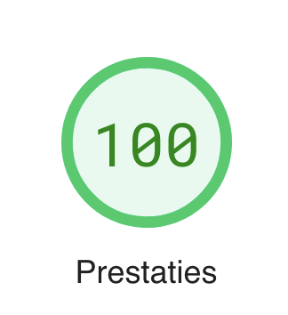

Soms beruipt je het gevoel dat je site niet meer helemaal haantje de voorste is. Hij staat nog wel prima live, maar je denkt dat er meer in het leven moet zijn dan wat plukjes HTML met wat CSS er doorheen geroerd. Dat gevoel bekroop ons onlangs bij [www.omloopdesnor.nl](https://www.omloopdesnor.nl). We besloten direct om de handen uit de mouwen te steken en de achterstand in één klap goed te maken met [Astro](https://astro.build) en [Tailwind CSS](https://tailwindcss.com/). Deze frameworks zijn zo gillend hip en afgrijselijk modern dat we de toekomst weer met vertrouwen tegemoet zien!

## Astro

Als eerste Astro. Tjonge wat een beest. Astro is een [static site generator](https://en.wikipedia.org/wiki/Static_site_generator) die met behulp van Javascript je site in elkaar zet. Astro genereert bloedsnelle sites doordat ze zo min mogelijk Javascript in je website proppen. Astro doet dat bijvoorbeeld veel beter dan de grote broer NextJS die je leuke websiteje als een kerstboom vol met Javascript hangt, waardoor hij niet meer vooruit te branden is. Daarom staan er op YouTube ook [video's](https://www.youtube.com/watch?v=PSzCtdM20Fc) met de strekking "Astro crushes NextJS performance".

### Island architectuur

Een ander goed idee van Astro is hun "Island architecture". Bij deze architectuur breekt Astro je website bij het genereren op in kleine, onafhankelijke componenten (de eilanden). Vervolgens kun je per eiland bepalen hoe deze geladen wordt en of er Javascript voor nodig is. Er wordt geen Javascript geladen als dat niet echt nodig is voor de werking van je eiland. Super efficient! Voor onze eigen [www.omloopdesnor.nl](https://www.omloopdesnor.nl) boeit dit trouwens totaal niet, want we hebben geen onderdelen die Javascript nodig hebben. Maar toch leuk.

## Tailwind CSS

Niet zo nieuw Astro, maar wel veel bekender is Tailwind CSS. Met Tailwind CSS hoeft je geen CSS classes meer in een apart CSS bestand te maken, maar is alles "[Utility first](https://tailwindcss.com/docs/utility-first)". In plaats van gehannes met zelf bedachte CSS classes, hannes je de standaard classes van Tailwind CSS gewoon in je HTML. Je kan dus, net als in de nineties, gewoon alle styling inline in je HTML code zetten. Je divje ziet er dan bijvoorbeeld zo uit:

`
`

Niet mega overzichtelijk, maar dat is nooit het sterke punt van CSS geweest. Al met al werkt het best aardig.

## Tot slot: Prestaties

Maar dan de presetaties. Nou, ga daar maar eens goed voor zitten. Volgens Google kan de site niet veel sneller dan dit! 100 van de 100 punten hebben we [gekregen](https://pagespeed.web.dev/report?url=https%3A%2F%2Fomloopdesnor.nl%2F&form_factor=mobile).

En nu hoor ik je denken: "Ja, maar Joris. Dit is een mini site met een paar foto's erop. Waar heb je het in godsnaam over?". En daar heb je volkomen gelijk in. Deze site krijg je ook fancy technieken wel snel. Maar wat is daar de lol van? Ik ben een enorme Javascript/Typescript noob, maar het is altijd leuk om een beetje te pielen. Vandaar.
