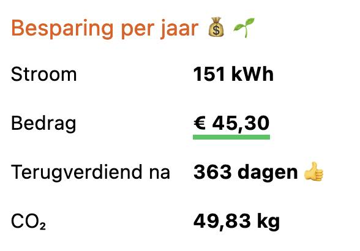

Stroom is duur en het klimaat gaat naar de tering. Redenen genoeg om wat aan je stroomverbruik te doen. Maar hoe kom je erachter wat effectief is? En wanneer heb je die ledlampen eigenlijk terugverdiend? De trouwe lezer van Geensnor weet nu waarschijnlijk al waar dit heen gaat: we hebben weer iets nieuws gemaakt. Klopt helemaal trouwen lezer! Dit keer is het een [tool](https://stroomkosten-besparing-berekenen.vercel.app/) om stroomkosten besparingen door te rekenen.

> Geldbesparen was nog nooit zo leuk en makkelijk!

## Oke, wat is dit nu weer?

Door stroomkosten, kosten van je investering en wat verbruiksgegevens in te vullen vertelt de tool je hoeveel geld je bespaart en wanneer je je investering hebt terugverdiend. En hoewel [een duurzamere wereld niet bij jezelf begint](https://www.vn.nl/pleidooi-tegen-consumentenactivisme/), is het toch aardig om te weten dat je besparking wel _iets_ doet met je CO₂ uitstoot. Door de cijfers aan te passen, kun je kijken of je besparing effectief is.

## Voorbeeld bitte

Stel je TV staat het grootste gedeelte van de dag standby. Dit verbruikt samen met dat irritante klote kastje van je kabelmaatschappij 20 watt. Het leven is al druk genoeg, dus 's avonds gaan de slofjes aan en kijk je ook nog gemiddeld 3 uur per dag TV wat 100 watt verbruikt. Je betaalt 30 cent per kWh aan stroom. Omdat je je hele huis al vol dure Philips Hue spullen hebt hangen, ben je benieuwd of je zo'n [Hue Smart Plug](https://partner.bol.com/click/click?p=2&t=url&s=1122314&f=TXL&url=https%3A%2F%2Fwww.bol.com%2Fnl%2Fnl%2Fp%2Fphilips-hue-smart-plug-slimme-stekker-nederland%2F9200000117474487%2F&name=Philips%20Hue%20Smart%20plug%20Slimme%20Stekker%20-%20Nederland) van 45 euro vlot hebt terugverdiend. Een kort bezoekje aan onze fijne tool, levert je binnen enkele ogenblikken de volgende conclusie op.

Dus met andere woorden: na een jaar heb je hem terugverdiend. Aanschaffen dus! En omdat je de lulligste niet bent, klik je voor je aanschaf op [deze affiliate link van bol.com](https://partner.bol.com/click/click?p=2&t=url&s=1122314&f=TXL&url=https%3A%2F%2Fwww.bol.com%2Fnl%2Fnl%2Fp%2Fphilips-hue-smart-plug-slimme-stekker-nederland%2F9200000117474487%2F&name=Philips%20Hue%20Smart%20plug%20Slimme%20Stekker%20-%20Nederland) waardoor de de makers van de tool ook nog een fijne kerst bezorgd.

## Jaja, de makers

Ja, de makers ja. De makers zijn dezelfde stevelingen die onlangs nog de [site van Omloop De Snor](https://www.omloopdensnor) naar het pantheon der moderniteit hebben verheven, door hem om te bouwen in Astro, opgeleukt met een krokantje van TailwindCSS. Als je hier meer van wilt weten, kun je [het bericht hieronder](/omloop-opgefrist) lezen.

Voor de [stroomkosten besparing berekenen tool](https://stroomkosten-besparing-berekenen.vercel.app/) (hmm, misschien nog een goede naam verzinnen), hebben ze iets vergelijkbaars gedaan. Behalve Astro en TailwindCSS, hebben ze in dit geval ook nog wat [Svelte](https://svelte.dev/) gebruikt. Svelte biedt net wat meer mogelijkheden en werkt verder heel prima. Als je ook geinig webdingen wilt maken, zou ik er zeker eens naar kijken.

Alles staat [op GitHub](https://github.com/geensnor/stroomkosten-besparing-berekenen), mocht je nog een goed idee hebben.
