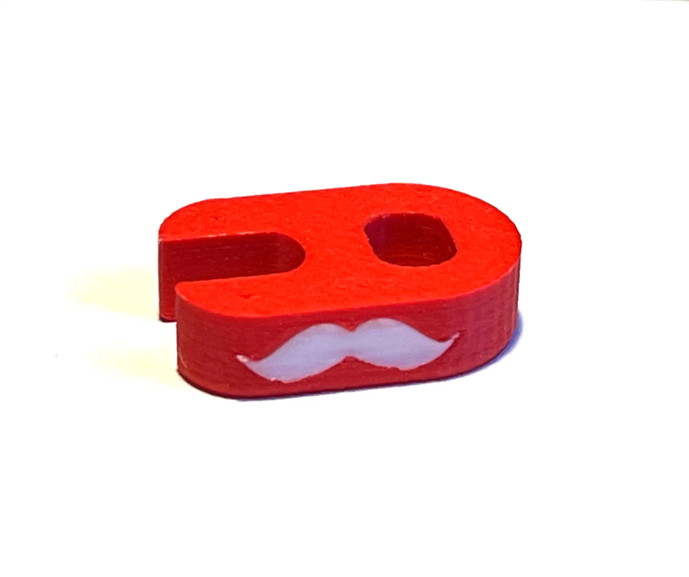

Elke wielrenner kent het probleem. Lekke band onderwerg. Je hebt net je band succesvol verwisseld, maar bij het oppompen gaat het mis. Telkens als je je pompje eraf wilt draaien nadat je je band hebt opgepompt, draait ook het ventiel ermee af. Je handen zijn helemaal vettig en goor, dus even dat ventieltje goed vastdraaien gaat ook niet. Eindeloos blijf je klooien om je band weer vol lucht te krijgen.

De oplossing hiervoor is al lang uitgevonden: een ventielsleutel. Met een ventielsleutel schroef je de ventiel even echt goed vast zodat hij ook vast blijft zitten als je het fietspompje losschroeft.

## Geensnor ventielsleutel

Zo'n ventielsleutel kost je al snel [50 cent](https://hollandbikeshop.com/fietsgereedschap-fietsonderhoud/fietsgereedschap/banden-fietsgereedschap/ventiel-sleutel/schwalbe-ventielsleutel-frans-ventiel-zwart-1-707739/) en die is dan ook nog eens lelijk en zwart. Maar om de start van het nieuwe wielrenseizoen luister bij te zetten, heeft de directie van Geensnor eens diep in de buidel getast en een een aantal fraaie geensnor ventielsleutels laten 3D printen. Door het gebruik van verschillende kleuren filament, hebben we zelfs een fraai snorretje in de ventielsleutel kunnen verwerken!

## Hebben

Wil je er ook een hebben? Laat het weten via [Telegram](https://t.me/geensnor), [Mastodon](https://mastodon.xyz/@geensnor), [Strava](https://www.strava.com/clubs/geensnor) of [Matrix](https://matrix.to/#/#geensnor:matrix.org) en als we je een keer tegen komen, krijg je er een!

Als je zelf een 3D printer hebt, kun je de .stl ook downloaden vanaf [onze Digitale Tuin](https://www.dedigitaletuin.nl/docs/wielrennen/wielrennen-3dprint) en hem lekker zelf uitprinten.
