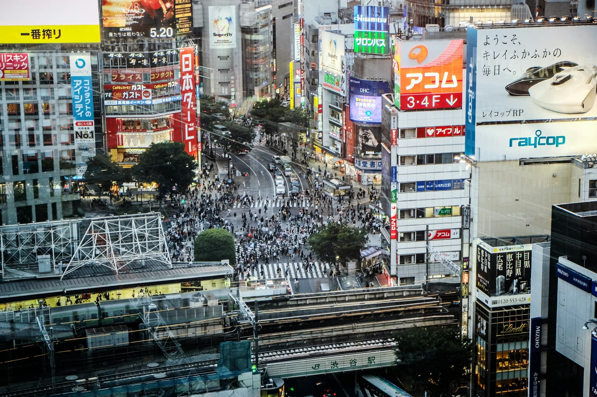

Erik brak er in [zijn standpunten](https://www.dedigitaletuin.nl/lijsten/lijsten-standpuntenvanerik/) al een lans voor: We moeten stoppen met reclame maken in de publieke ruimte. Het is lelijk, slecht, ongezond en we worden er uiteindelijk allemaal slechter van.

## Beïnvloeding

Niemand kan om de publieke ruimte heen. Anders dan bij een website vol reclame, is er geen alternatief. We worden op dit moment allemaal door onze gemeente gedwongen om te kijken naar reclame, die speciaal gemaakt is om keuzes die je maakt te beïnvloeden. Dit maakt reclame in de publieke ruimte ook zoveel erger dan andere reclame: er is geen ontsnappen aan. Zit je toevallig krap bij kas, maar moet je je hongerige lieve kindje nog te eten geven? Jammer joh, je wordt toch gemanipuleerd zodat je toch je laatste, zuurverdiende centen gaat uitgeven aan iets onnuttigs.

En natuurlijk is het onnuttig. Je kan op zoveel andere manieren informatie krijgen over spullen die je wel nodig hebt, daar hebben we echt geen lelijke bushokjes voor nodig die ons dat toeschreeuwen.

## Lelijk

Hier ga ik niet teveel woorden aan vuil maken. Reclames zijn graflelijk en ik wil niet dat mijn omgeving graflelijk is.

## Functie

De functie van de publieke ruimte wordt ook aangetast. Je wil er lekker ontspannen of mensen ontmoeten. Beetje hangen, potje kubs spelen, dat werk. Maar als diezelfde ruimte wordt gebruikt voor reclame, wordt de functie (of op z'n minst gedeeltelijk): geld verdienen. Iets publieks, wordt privaat gemaakt. Het resultaat is minder ruimte en vrijheid voor ons allemaal. En moeten we de plek waar we juist kunnen ontkomen aan alle reclame op TV en internet, ook nog commericeel gaan uitbuiten....?? (nee, het antwoord is: nee).

## Geld

Ik hoor je als lezer nu al denken: "Ja, leuk en aardig. Maar die fraaie bibliotheek om het proletariaat te verheffen, is in onze gemeente betaald met het geld van adverteerders.". Prima, maar ik ga hier natuurlijk niet de hele gemeentebegroting behandelen.

Bedrijven investeren in reclame omdat ze meer troep willen verkopen. En blijkbaar werkt dat, want anders zouden ze het niet doen. Maar al die troep die extra verkocht wordt door reclame, hebben we als gemeenschap helemaal niet nodig. Bedrijven proberen ons klimaat net iets meer te verneuken en ons net iets dikker en ongezonder te maken door te adverteren. Goede keuzes maken is zonder reclame al moelijk genoeg.

En waar gaan die dikke, arme, ongezonde mensen in dat verneukte klimaat straks allemaal een beroep op doen? Juist! Op diezelfde overheid die een paar jaar eerder een paar grijpstuivers kreeg van K.U.T. BV, zodat hun campagne over gratis PFAS frisdrank bij het winnen van een Fatbike (ow boy, daar kan ik ook nog op los gaan. Zie ander standpunt van Erik...) in hun "Dubai Pearl Andy Van Der Meijde Gold Winning Online" casino.

## Nuance

Maar Geensnor zou Geensnor niet zijn als er ook ruimte is voor nuance (niet die blonde van Lingo..). Publieke ruimte kun je wel gebruiken voor publieke zaken. Wat voor publieke zaken dan? Nou, bijvoorbeeld een keurige, smaakvolle aankondiging voor de opening van een nieuwe bibliotheek om het proletariaat te verheffen. Word je toch weer beïnvloed terwijl je er niet op zit te wachten, maar het doel is in elk geval beter. Misschien moeten we dit ook verbieden, maar hier zit nog wel wat ruimte voor discussie. Wij zijn de beroerdste niet om een handreiking aan onze tegenstanders te doen.

## Links

- [Groen Links wil er ook vanaf](https://www.wetenschappelijkbureaugroenlinks.nl/artikelen/het-hoog-tijd-voor-een-verbod-op-reclame-de-publieke-ruimte)
- [Zwitserse steden snappen het](https://www.bloomberg.com/news/articles/2024-07-26/zurich-bern-consider-billboard-bans-after-vernier-outlaws-visual-pollution)
- [Grapje van speld.nl: Nederland Premium: voor 14,99 per maand over straat zonder reclames](https://speld.nl/2024/08/27/nederland-premium-voor-1499-per-maand-over-straat-zonder-reclames/)
