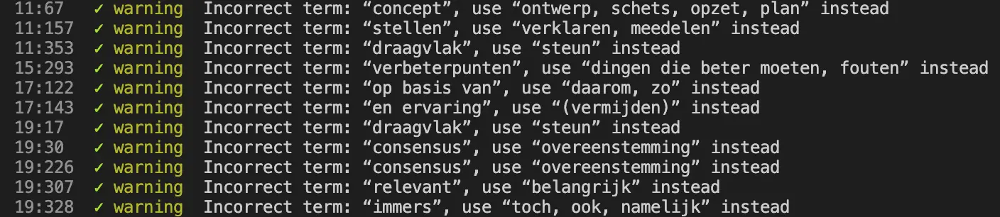

Ik heb een [lijst](https://www.npmjs.com/package/moeilijke-woorden) gemaakt met moeilijke woorden. Deze lijst kan gebruikt worden door de tool [Textlint](https://textlint.github.io/) om moelijke woorden uit teksten te halen en toont zelfs een paar alternatieven.

Het is fijn als de teksten die op internet geschreven worden, een beetje leesbaar zijn. Mensen lezen toch al weinig op het internet, maar als de teksten dan ook nog slecht zijn wordt het helemaal lastig. Een belangrijk onderdeel van een begrijpelijk tekst, is het gebruik van begrijpelijk woorden.

## Moeilijke woorden, moeilijk vindbaar

Maar wat zijn begrijpelijke woorden en wat zijn moeilijke woorden? Dat is nog niet zo eenvoudig. Een stevige rondklik-sessie op het internet leverde in elk geval geen mooie, duidelijke lijst op. Het blijkt dat er wel allerlei regels zijn die zeggen dat je geen moeilijke woorden moet gebruiken, maar echt duidelijk zijn die niet:

- [WCAG richtlijn 1.3.1](https://digitaaltoegankelijk.nl/wcag-uitgelegd/3-1-3-ongebruikelijke-woorden-wcag-niveau-aaa/)
- B1 taalniveau van de Raad van Europa
- ISO 24495

## Oplossing

Uiteindelijk bood [taalvereniging Onze Taal](https://onzetaal.nl) uitkomst met hun ["lijst van woorden die je beter kunt vermijden"](https://onzetaal.nl/taalloket/modern-taalgebruik). Deze lijst goot ik vrij eenvoudig in een .json bestand en was daardoor bruikbaar voor [Textlint](https://textlint.github.io/). Met Textlint kun je bijvoorbeeld Markdown en HTML bestanden [linten](https://en.wikipedia.org/wiki/Lint_(software)) en de moeilijke woorden eruit halen.

De lijst van Onze Taal is trouwens niet zaligmakend. Het woord "daar" staat er ook in, maar dat is volgens mij niet een enorm moeilijk woord. Het woord staat er waarschijnlijk in voor als "daar" wordt gebruikt in een zin als "De olifant pastte niet in de grijze kliko die Marieke aan de straat wilde zetten, daar het beest veel te groot en koppig was", maar een linter kijkt natuurlijk niet naar de hele zin.

Het blijft daarom mensenwerk, maar je kan wel makkelijk moelijke woorden opsporen. Deze post bevat bijvoorbeeld geen moeilijke woorden, op "daar" na. Textlint en de "moelijke woorden lijst" zijn ook toegevoegd aan [geensnor.nl](https://www.geensnor.nl), zodat we de hele site kunnen doorspitten. Helaas bevatten onze posts aardig wat moeilijke woorden... 🫣
