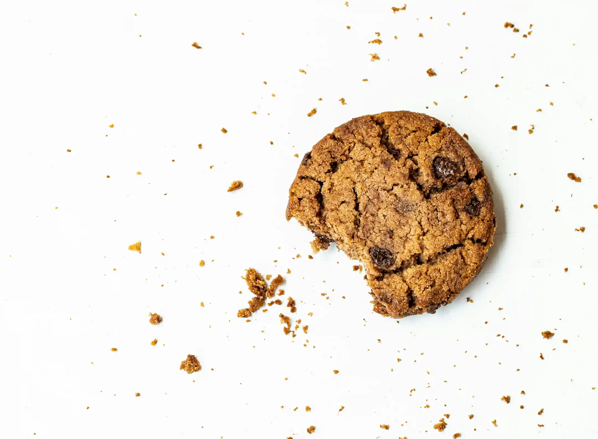

Veel bedrijven en organisaties proberen voor een paar grijpstuivers, persoonsgegevens los te peuteren van onschuldige websitebezoekers. Het resultaat is dat het internet vol staat met spuuglelijke en onhandige cookiebanners. De universiteit van Aarhus vond dat de maat vol was, en ontwikkelde een paar jaar terug [Consent-o-matic](https://consentomatic.au.dk/). Deze browserplugin wijst automatische alle cookies af (je kan sommige ook toe staan trouwens...) zodat je als websitebezoeker je leven weer een beetje terugkrijgt.

## Het probleem

Consent-o-matic is alleen niet zaligmakend. Cookiebanners veranderen nog wel eens en de regels om een banner we te klikken moeten dan weer aangepast worden. En dat gaat niet altijd even vlot. Zo staat e Pull Request om de banner van de boeven van DPG Media weg te klikken, [alweer een tijd open](https://github.com/cavi-au/Consent-O-Matic/pull/475).

## De oplossing

Maar hier komt die typische can-do metaliteit van Geensnor weer eens van pas. Wij hebben een eigen lijst met regels gemaakt! Een lijst die we geheel open stellen voor bijdragen vanuit het dappere volk wat [geensnor.nl](https://www.geensnor.nl) leest. Voeg de onderstaande link toe aan je Consent-o-matic plugin en wij zorgen ervoor dat we blokkeren wat we kunnen! De lijst

[https://raw.githubusercontent.com/geensnor/DeDigitaleTuin/refs/heads/main/public/consent/rules-list.json](https://raw.githubusercontent.com/geensnor/DeDigitaleTuin/refs/heads/main/public/consent/rules-list.json)

Als je deze link toevoegt, wordt DPG Media weer meteen geblokkeerd. Maar we hebben geen tijd om op onze lauweren te rusten, want de regel van [bol.nl](https://github.com/cavi-au/Consent-O-Matic/blob/master/rules/bol.json) werkt ook voor geen ene meter.
