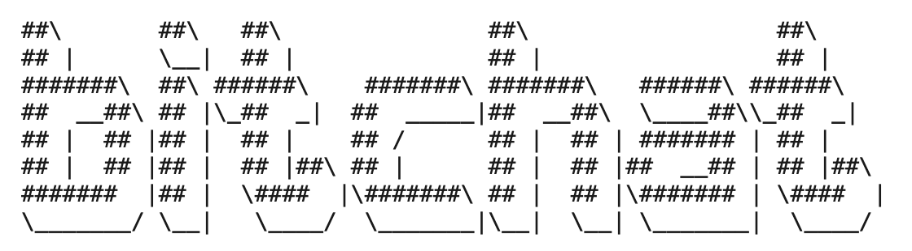

Jack Dorsey, bedenker van Twitter, Bluesky en Square, heeft een nieuwe chatapp [gevibedcoded](https://www.businessinsider.com/jack-dorsey-bitchat-app-vibe-coded-2025-7?international=true&r=US&IR=T): [Bitchat](https://bitchat.free/). Met Bitchat kun je peer-to-peer chatberichten versturen via Bluetooth Low Energy. Alles werkt helemaal zonder centrale server of internet verbinding. Ik heb het geprobeerd en het werkt best aardig.

Elke momenten nadat Jack z'n appje online had gezet, [stroomde](https://www.inc.com/chloe-aiello/security-flaws-with-jack-dorseys-bitchat-highlight-a-system-problem-with-vibe-coding/91212412) de security problemen binnen. Bleek dat een beetje kwalitatief vibecoden nog geen sinicure is. Het schijnt dat de meesten problemen verholpen zijn, maar Jack heeft wel een melding op z'n site gezet dat het appje misschien nog kwetsbaarheden bevat.
