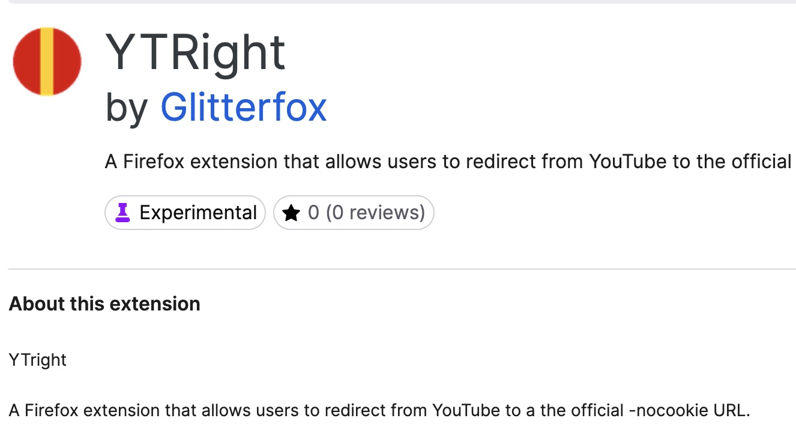

TL;DR: Nieuwe firefox plugin gemaakt om advertenties te skippen op YT [https://addons.mozilla.org/en-US/firefox/addon/ytright/](https://addons.mozilla.org/en-US/firefox/addon/ytright/)

Dus het is 2026 en een beetje normaal video's kijken op youtube zit er eigenlijk al [jaren](https://brisktechsol.com/youtube-ads-are-getting-worse/) [niet](https://www.verdict.co.uk/analyst-comment/youtube-ad-heavy-drives-user-abandonment/) [meer](https://www.youtube.com/watch?v=64gvdXFE9P4) [in](https://www.youtube.com/watch?v=6R1PRg_8Eqg). Een beetje video heeft al snel 5 tot 7 videos (voorheen 2-3) die je om de minuut in je smoel krijgt gedrukt en uiteraard minimaal tig seconde moet kijken voordat je eindelijk op de skip knop kan klikken. Eigenlijk bestaat video kijken op youtube vooral wachten op het moment dat je dat ene skip knopje ziet, wat een tamelijk treurige constatering is. En als het dan nog een beetje aan te zien was allemaal maar nee hoor. De hele tijd die enorme treurige droeftoeter die zegt dat duizenden andere Nederlanders mij voor gingen en dat grote bedrijven niet willen dat ik iets weet. 1 dikke bak stront dus...dat hele youtube en verschrikkelijk irritant dat je toch bent aangewezen op die poel des verderf als je gewoon geinige [lego filmpjes](https://www.youtube-nocookie.com/embed/6bjLbQCxSQA?playlist=6bjLbQCxSQA&autoplay=1&iv_load_policy=3&loop=1&start=) of [nerd filmpjes](youtube.com/@lgr) wilt kijken. Tijd om dit varkentje te wassen en gewoon weer filmpjes te kunnen kijken. 

## Zet een - achter de t in youtube

Tot deze week maakte ik altijd gebruik van de [https://www.yout-ube.com/](https://www.yout-ube.com/) truc. Gewoon simpel een streepje achter de t in de URL, op enter rammen (soms nog een keer f5-en) en papa kon de filmpjes zonder de advertenties zien. Dat werkt op zich heel fraai. Yout-ube redirect je direct naar de (officiële ) no-cookie versie van youtube en daarop worden geen advertenties geserveerd. Maar in de praktijk waren dat toch een paar handelingen te veel.

## 1 druk op de knop...met YTRight!

En dus schreef ik YTRight. Of schreef schreef. Ik vibde die zooi in elkander en maakte een extensie voor Firefox. Servicegericht direct vanuit de menubalk druk je vanaf nu met 1 click alle advertenties de vergetelheid in en geef je aandacht aan zaken die je aandacht verdienen. De pure rauwe content zonder commercieele uitbuiting van de heren van Google! Na een paar dagen review van de vrienden van mozilla is de extensie vanaf heden te downloaden [https://addons.mozilla.org/en-US/firefox/addon/ytright/](https://addons.mozilla.org/en-US/firefox/addon/ytright/)
