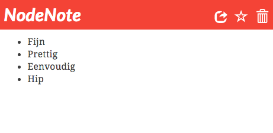

Bij het maken van notities helpt het om een hiërarchie aan te brengen. Je begint met iets abstracts en vaags en je werkt het steeds verder uit naar concrete onderdelen of acties. Mindmapping werkt ook ongeveer op die manier.

Omdat ik vond dat er geen goede manier was om dit soort dingen vast te leggen, heb ik zelf maar iets gemaakt: **NodeNote.**

Met NodeNote kun je notities maken en parent/child relaties tussen notities leggen. Op die manier ontstaat er een soort piramide van aantekeningen. Het is ook mogelijk om een notitie 'publiek' te maken waardoor iedereen met de juiste URL de notitie en de notities eronder kan bekijken. Hieronder staat zo'n publieke URL waar NodeNote zelf wordt uitgelegd.

<a href="https://www.geensnor.nl/nn/public/21745c5b653913afaa54" target="_blank">https://www.geensnor.nl/nn/public/21745c5b653913afaa54</a>

Als je naar <a href="https://www.geensnor.nl/nn" target="_blank">https://www.geensnor.nl/nn</a> gaat, kun je meteen beginnen met NodeNote
