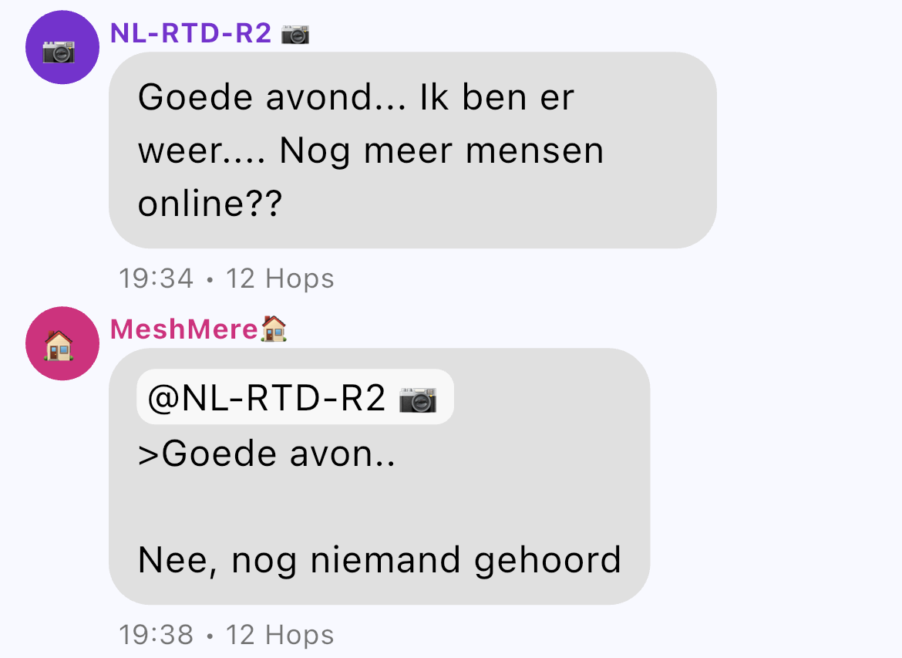

Eerder [schreven](./meshtastic) wij op geensnor.nl al wat over mesh netwerken. Dit soort netwerken bestaan uit goedkope apparaatjes van hobbyisten die gezamelijk een netwerk vormen waar berichten mee verstuurd kunnen worden. Destijds was Meshtastic nog helemaal hip en happing. De techniek heeft ondertussen niet stil gestaan en inmiddels is Meshcore helemaal booming.

## Verschil tussen Meshtastic en Meshcore

Meshcore zou je kunnen zien als de serieuze, grote broer van Meshtastic. Bij Meshtastic is (bijna) elke node in het netwerk zowel een client (lezen en schrijven van berichten) als een repeater (doorsturen van berichten). Opzich lekker overzichtelijk, maar al die nodes sturen alles wat ze tegenkomen in het netwerk meteen door. Flooding heet dat. In een klein netwerk werkt dat prima, maar bij meer nodes wordt het al snel een enorme puinzooi.

Bij de installatie van Meshcore moet je kiezen wat je apparaat gaat doen: client of repeater. Een combinatie kan niet. Het echte netwerk bestaat dus uit repeaters. De clients "hangen" daar een beetje aan, maar praten meestal niet onderling. De repeaters werken bovendien met path discovery: ze houden de beste route voor een bericht bij en gebruiken die route vaker. Ze sturen dus niet, zoals bij Meshtastic, alles door wat ze langs zien komen. Hierdoor komen berichten beter aan, vooral over grote afstanden. Doordat het netwerk minder wordt belast, kunnen berichten vaker hoppen tussen repeaters en hierdoor kun je berichten over grotere afstanden versturen.

## Proberen!

Met de [web flasher](https://flasher.meshcore.dev/) van Meshcore heb je binnen een mum van tijd je Meshtastic spullen naar Meshcore omgebouwd. M'n Heltec is nu een repeater die op zolder staat en de SenseCAP T1000-e een client. Wat opvalt is dat de accu van de SenseCAP veel langer meegaat. Alleen maar voordelen dus!

## Links:

- [YouTube video van HCC](https://www.youtube-nocookie.com/embed/k6fwjjjirq4)
- [Pagina op De Digitale Tuin over Meshcore](https://www.dedigitaletuin.nl/soft-en-hardware/meshcore/)
