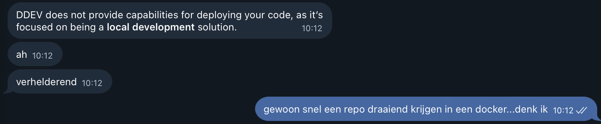

Wie kent het niet. Je haalt een leuke repo ergens op en bent vervolgens uren aan het klooien om de boel een beetje te laten draaien. Dat was met php en databases al gedoe, anno 2026 met allerlei frontend frameworks en bergen dependencies vergt dat speciale oplossingen. Conceptmatig regelen veel frontend frameworks dat gelukkig zelf al. In astro (waar Geensnor op draait) wordt dat bijvoorbeeld ondervangen met Vite en NPM dat snel een lokale ontwikkelomgeving start inclusief alle afhankelijkheden. Maar ook daar blijf je afhankelijk van de juiste Node versie en werk je niet totaal geïsoleerd aan een project. Lokale Projecten kunnen met elkaar in conflict raken. Het blijft een beetje geklooi en het zijn allemaal oplossingen voor min of meer dezelfde problematiek. Hoe krijg ik software lokaal draaiend zonder uren te besteden aan allerlei instellingen en installaties. In een geïsoleerde omgeving op een manier die snel opnieuw uit te voeren is.

Nu bestaat Docker al een tijdje en dat is natuurlijk de oplossing voor dit gedoe. Maar is om een of andere reden ook altijd moeilijk te begrijpen. Totdat de redactie op DDEV stuitte. DDEV stond oorspronkelijk voor Docker Development Environment. Je laat DDEV eerst een analyse maken van je repo. Kiest vervolgens wat voor soort applicatie het is en DDEV maakt volautomatische alle nodige containers aan. Het stelt de boel in, installeert vervolgens in de containers alsnog alle dependencies en klaar is kees.

## Ow wat mooi, hoe begin ik hiermee?

Om te beginnen heb je een docker-provider nodig. Op macOS zijn wij wel blij met OrbStack `brew install orbstack docker`. Vervolgens heb je DDEV nodig dat je ook eenvoudig met homebrew installeert (`brew install ddev/ddev/ddev`). Om SSL gezeik over certificaten nog te voorkomen is het handig om eenmalig een lokale CA te vertrouwen met `mkcert -install`

Dan zijn we er klaar voor en begint de wondere wereld van DDEV. Met `ddev config` maak je een nieuw project aan. DDEV scant je source code, maakt een config file aan van alle nodige software. Die kan je nog een beetje tweaken in de `config.yaml` die aangemaakt is in je repo. Zo heb je bijv. lang niet altijd een database nodig. Soms moet je daarna nog bijvoorbeeld `ddev npm install` of `ddev composer install` uitvoeren om alle dependencies ook aan boord te krijgen. Met `ddev start` start je vervolgens alle containers en zie je ze netjes draaien in orbstack. De [Get-started](https://ddev.com/get-started/) pagina van DDEV is duidelijk, kijk ook daar vooral verder.

## Schiet ik hier nou veel mee op?

Dat is maar de vraag. DDEV is vooral handig bij applicaties die bijv. ook een database gebruiken of eigen domeinen en routing nodig hebben. Maar voor het draaien van Geensnor.nl is de meerwaarde wat beperkter maar blijven natuurlijk de algemene voordelen van een docker container wel staan.

1. Geïsoleerd waardoor je weinig last hebt van instellingen op de client (bijv. node.js versies) of andere projecten waar je ook aan werkt en die zaken delen
2. Platform onafhankelijk. Draait het docker, dan draai je de applicatie.
3. Sneller aan de gang. Vergeet de services en zooi installeren op je client. Start gewoon de docker image!

## Zelf ervaren?

Wil je het snel zelf ervaren? In de Geensnor repo hebben we een ddev yaml neergezet waarmee je direct Geensnor kan draaien! [Haal de repo op](https://github.com/geensnor/geensnor.nl) en start Geensnor met `ddev start`!.
