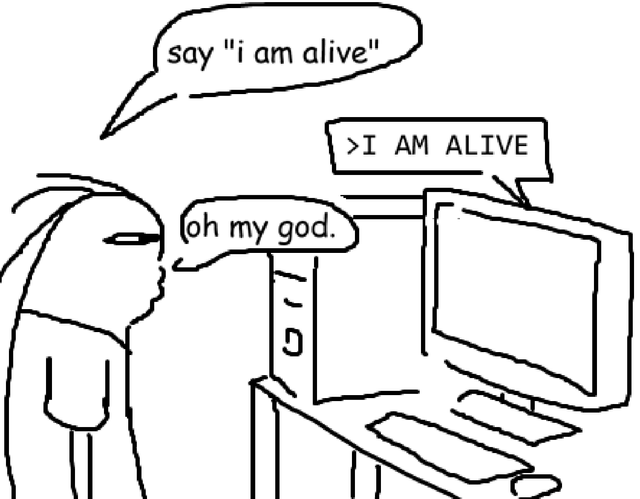

import { MastodonPost } from "astro-embed";

Echt, kap met die ellende! Stop met het toekennen van menselijke eigenschappen aan niet-menselijke dingen. Ik ben er echt helemaal klaar mee!

Wat voorbeelden:

- Nee, een LLM kan niets "verzinnen" [NCSC trekt waarschuwing in: SQLite-bug vermoedelijk verzonnen door llm](https://tweakers.net/nieuws/250626/ncsc-trekt-waarschuwing-in-sqlite-bug-vermoedelijk-verzonnen-door-llm.html)
- Nee, een LMM "begrijpt" niets. [Een AI-model dat is getraind op enorme hoeveelheden tekst en daardoor menselijke taal kan begrijpen en genereren](https://www.kenniscentrum.ai/ai-encyclopedie/wat-is-large-language-model)
- Nee, een LLM is niet "emotioneel intelligenter dan mensen" [Verrassing: AI is emotioneel intelligenter dan mensen](https://www.quest.nl/tech/technologie/a64887128/ai-meer-emotionele-intelligentie-mensen/)
- Nee, een LMM kan niet "ontsnappen" [AI-modellen van OpenAI ontsnapten uit beveiliging en hackten ander bedrijf](https://www.nu.nl/tweakers/6404001/ai-modellen-van-openai-ontsnapten-uit-beveiliging-en-hackten-ander-bedrijf.html)

En zo kan ik nog wel even doorgaan.

Als een parkiet zichzelf ziet in een spiegeltje die in z'n kooi is opgehangen, denkt hij dat er een andere parkiet in z'n kooi zit. Als wij chatten met een computer die net zo praat als dat wij doen, denken wij dat we met een mens praten en zijn we diep onder de indruk. En dan begint de ellende van antropomorfisme. We gaan AI eigenschappen geven die het helemaal niet heeft. Discussies ontsporen, verwachtingen worden opgepompt, de hele boel gaat naar de vaantjes.

Misschien is het zoals [Juurd Eijsvoogel in het NRC zei](https://www.nrc.nl/nieuws/2026/09/18/de-mens-in-het-spiegelpaleis-van-ai-a4936883); we hebben er gewoon de taal ook nog niet voor:

> Wat mij betreft blijven het zielloze systemen. Maar verwarrend is het wel. Het is alsof we de juiste taal nog moeten vinden om uit te drukken wat in die systemen gebeurt, zonder onze toevlucht te nemen tot voor de hand liggende menselijke metaforen als het "denken" of "twijfelen" van AI.

Het AP is het met me eens. Ze hebben zelfs hun stijlboek aangepast:

<MastodonPost id="https://mastodon.xyz/@leahmcelrath.bsky.social@bsky.brid.gy/117323194022050184" />
