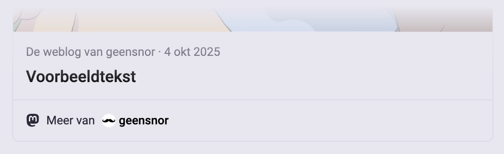

Al [sinds 2018](/geensnor-legt-uit-mastodon-activitypub/) zijn we hier op Geensnor erg gecharmeerd van Mastodon. Sinds die tijd hebben we ook een [Mastodon account](https://mastodon.xyz/@geensnor), maar van echte liefde tot nu toe nog geen sprake. De afgelopen tijd hebben we vier nieuwe functies op deze site toegevoegd, en nu durven we wel te zeggen dat het er behoorlijk "Nisha Tara en Lieske" aan toe gaat tussen Geensnor en Mastodon.

Laten we het viertal uitpakken...

## 1. Delen op Mastodon

Als je een bericht van een blog wil delen op Mastodon, moet je ook nog de juiste instantie kiezen. Mastodon heeft daarom [een eigen deelknop](https://blog.joinmastodon.org/2026/03/a-new-share-button/) die je daarbij helpt. Sinds een tijd staat deze prachtige knop rechtsonder elk bericht op Geensnor.nl. Dus ik zou zeggen: delen maar die berichten!

## 2. Mastodon embedden

Soms wil je een blog op Mastodon delen, en soms wil je een Mastodon bericht op Geensnor zetten. Net andersom dus. Met behulp van [astro-embed](https://astro-embed.netlify.app/) hebben we het voor elkaar gekregen om een Mastodon bericht te embedden op Geensnor. [Een bericht eerder](/2026-09-21-weg-met-antropomorfisme) hebben we dat zelfs al gedaan!

Het embedden gaat niet vanzelf. Het werkt niet in Markdown dus je moet een .mdx van je post maken. Vervolgens moet je het component importeren

`import { MastodonPost } from "astro-embed";`

en tot slot moet je met het component het Mastodon bericht embedden

`<MastodonPost id="https://mastodon.xyz/@geensnor/117315994110748102" />`

## 3. Auteurs tonen

Deze blog schrijft zichzelf niet en elk bericht is tot stand gekomen door slecht betaalde auteurs. Dan is het natuurlijk wel aardig al je naam ook bij het bericht op Mastodon verschijnt. Met twee mooie woorden wordt dit ook wel 'Author Attribution' genoemd.

Een metatag met het Mastodon account van de auteur wordt toegevoegd aan het bericht als de site wordt gebuild:

`<meta name="fediverse:creator" content="@yourusername@mastodon.social">`

Als die pagina dan op Mastodon wordt gedeeld, wordt de auteur met z'n Mastodon account erbij gezet. Op de voorpagina staan alle auteurs door elkaar, dus daar houden we Geensnor zelf aan als auteur. Op de detailpagina's van de berichten de auteur van het bericht zelf.

Klein dingetje nog voor de auteurs zelf: je moet onderaan de instellingenpagina die over verificatie gaat ([https://mastodon.social/settings/verification](https://mastodon.social/settings/verification)) even 'geensnor.nl' toevoegen zodat Mastodon weet dat hij vanaf dat domein de auteur mag attributen. Dat was deze auteur even vergeten en dat kun je het attributen wel op je buik schrijven.

## 4. Reacties

En dan het absolute magnum opus van deze Mastodon update: reacties. Reacties hebben het niet makkelijk gehad op Geensnor. Vroeger moest je je eerst op Wordpress registereren. Daarna misbruikten we [GitHub](https://utteranc.es/) om reacties op bij te houden. En tijden lang hebben we ook niets gehad.

Nu voel je misschien al een beetje waar we de reacties deze keer vanaf gaan halen... inderdaad: Mastodon. Elk bericht op Geensnor heeft ook een bericht op Mastodon als het goed is. Als je het id van het bericht op Mastodon in de [Frontmatter](https://daily-dev-tips.com/posts/what-exactly-is-frontmatter/) van het bericht op Geensnor zet, worden die twee aan elkaar gekoppeld. Als de site wordt gebuild, kijkt Astro even op Mastodon of er nog reacties zijn bij het bericht. Als dat zo is, worden de reacties onder het bericht op Geensnor gezet. Reactie op Mastodon = Reactie op Geensnor. Wauw...
